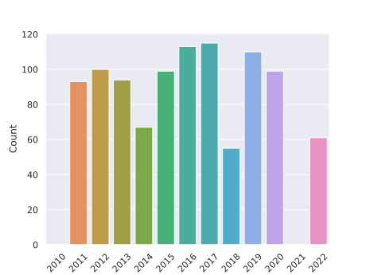
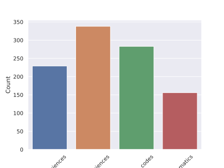

## Dataset description

Dataset extracted from the tests available on the INEP website.
- https://www.gov.br/inep/pt-br/areas-de-atuacao/avaliacao-e-exames-educacionais/enem/provas-e-gabaritos

The available data were obtained from tests in PDF and scripts were used to read and process the files to extract the texts related to the questions and alternatives.

### Description of the dataframe.

```
Columns:
- description (str): containing the text relative to the question
- alternatives (list[str]): list of string containing the alternatives to the question
- year (int): year of the application of the question
- subject (str): the area of subject [Linguagens, códigos e suas tecnologias; Ciências humanas e suas tecnologias; Ciências da natureza e suas tecnologias; Matemática e suas tecnologias]
- ground_truth (str): correct alternative of the question
```

### Vizualizations of the data

- Amount of questions by year



- Distribuition of data between the areas of knowlege



### Code used


All the code used to process the data can be found at
- https://github.com/wineone/tcc-matheus-lisboa